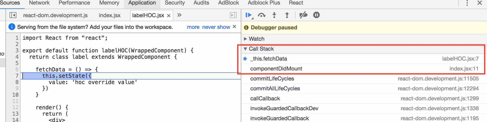
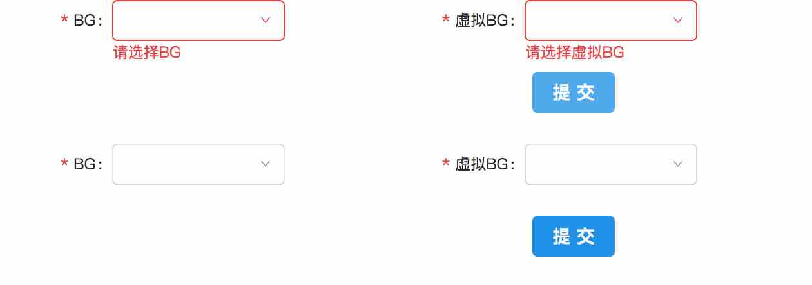

# React & ant.design 使用小结

## **列表元数据中的key不能使用索引**

具体细节参见文章：

+ [React 实践心得：key 属性的原理和用法](http://taobaofed.org/blog/2016/08/24/react-key/)
+ [index作为key是反模式](https://segmentfault.com/a/1190000006152449)

代码中可使用[shortid](https://github.com/dylang/shortid)类库生成随机ID

## **设置默认props**

```javascript
export default class Order extends React.Component{
  static defaultProps = {
    name : 'test'
  };

  render(){
    return <p>{this.props.name}</p>;
  }
}
```

如果babel设置为es6的转码方式，会报错，因为定义静态属性不属于es6，而在es7的草案中。es6的class中只有静态方法，没有静态属性，所以需将babel设置为es7的转码方式。

1. 先安装stage-0组件，其包含了es7的特性

```shell
npm install babel-preset-stage-0 --save-dev
```

2. 在.babelrc文件添加以下配置

```json
{
  "presets": ["stage-0"]
}
```

## **Higher-Order Component (HOC)**

参考文章
> [React 高阶组件(HOC)入门指南](https://github.com/MrErHu/blog/issues/4)
>
> [深入理解 React 高阶组件](https://zhuanlan.zhihu.com/p/24776678)

1. 反向继承(Inheritance Inversion)实现重写被包裹控件中的方法

```javascript
import React from "react";
import labelHOC from "./labelHOC";

//hoc方法作为注解加到被包裹控件上
@labelHOC
export default class DemoInput extends React.Component {
  state = {
    value: ''
  }

  componentDidMount() {
    this.fetchData();
  }

  fetchData =()=>{
    this.setState({
      value:'demo input default value'
    })
  }

  render() {
    return <input value={this.state.value} {...this.props} />;
  }
}
```

```javascript
import React from "react";

export default function labelHOC(WrappedComponent) {
  //继承自被包裹控件
  return class label extends WrappedComponent {
    //override WrappedComponent中的方法
    fetchData = () => {
      this.setState({
        value: 'hoc override value'
      })
    }

    render() {
      return (
        <div>
          <label>demo</label>
          {super.render()}  //调用父控件的render输出
        </div>
      )
    }
  }
}
```

可以从callstack中验证控件是调用了hoc中override方法

最终页面效果


另外，这种形式，在HOC中可以通过super访问到被包裹控件的state、props、组件生命周期方法和 render 方法。

## **Ant.Desgin控件校验规则**

Ant.Desgin提供里控件校验规则功能，但必须作为[Form](https://github.com/ant-design/ant-design/blob/master/components/form/Form.tsx)的子元素才能生效。下面以一段代码示例

```javascript
  import React from "react";
  import {Form, Row, Col, Select} from "antd";

  const Option = Select.Option;
  const formItemLayout = {
    labelCol: {
      xs: { span: 24 },
      sm: { span: 7 },
    },
    wrapperCol: {
      xs: { span: 24 },
      sm: { span: 12 },
      md: { span: 10 },
    },
  };

  @Form.create()
  export default class OrderForm extends React.Component {
    handleSubmit = () => {
      this.props.form.validateFieldsAndScroll((errors, values) => {
        if (!errors) {
          //do something
        }
      });
    }
    render(){
      const {getFieldDecorator} = this.props.form;

      return (
        <Form>
          <Row>
            <Col span={4}>
              <Form.Item label={'BG'}
                {...FormItemLayout}>
                  {getFieldDecorator('BG', {
                    rules: [{
                      required: true, message: '请选择BG',
                    }],
                  })(
                    <Select>
                      <Option key='1' value='WXG'>WXG</Option>
                    </Select>
                  )}
              </Form.Item>
            </Col>
            <Col span={4}>
              <Form.Item label={'XBG'}
                {...FormItemLayout}>
                  {getFieldDecorator('XBG', {
                    rules: [{
                      required: true, message: '请选择虚拟BG',
                    }],
                  })(
                    <Select>
                      <Option key='1' value='XWXG'>XWXG</Option>
                    </Select>
                  )}
              </Form.Item>
            </Col>
          </Row>
          <Row>
            <Button onClick={this.handleSubmit}>提交</Button>
          </Row>
        </Form>
      );
    }
  }
```

以上代码存在以下问题:

+ Select等控件没有复用
+ 如果同时存在多个form，form submit时将触发其他form的校验规则。因为类中所有控件的props form属性都是指向同一个Form实例，即装饰器Form.create()
+ 代码耦合紧，影响后续维护

针对以上问题，优化代码如下

1. 封装Select控件

```javascript
  import React from "react";
  import { Select } from "antd";
  import shortid from "shortid"
  import FormItem from "../FormItem";

  const Option = Select.Option;

  export default class SelectList extends React.Component {
    render() {
      const { getFieldDecorator } = this.props.form;
      const { id, label, require, data } = this.props;

      return (
        <FormItem label={label}>
          {getFieldDecorator(`${id}`, {
            rules: [{ required: { require }, message: `请选择${label}` }],
          })(
            <Select>
              {
                data.map(item => {
                  return <Option key={shortid.generate()}
                            value={`${item.code}`}>
                            {`${item.name}`}
                          </Option>;
                })
              }
            </Select>
            )}
        </FormItem>
      );
    }
  }
```

2. 提取样式，封装到FormItem中

```javascript
  import React from "react";
  import { Form, Col } from "antd";

  static defaultProps = {
    span: 6
  }

  const formItemLayout = {
    labelCol: {
      xs: { span: 24 },
      sm: { span: 7 },
    },
    wrapperCol: {
      xs: { span: 24 },
      sm: { span: 12 },
      md: { span: 10 },
    }
  };

  export default class FormItem extends React.Component {
    render() {
      const { children, span, ...others } = this.props;
      return (
        <Col span={span}>
          <Form.Item {...formItemLayout}
            //将外部传递的props放在最后，这样如果存在相同属性时将覆盖前面的值，方便扩展
            {...others}>
            {children}
          </Form.Item>
        </Col>
      );
    }
  }
```

3. 封装Form，通过递归将Form实例参数form传递给每个控件，将校验规则指向到正确的form实例

```javascript
  import React from "react";
  import { Form } from "antd";

  @Form.create()
  export default class DecoratorForm extends React.Component {
    cloneDetailComponents = (children, form) => {
      return React.Children.map(children, child => {
        const subChildren = child.props.children;
        //递归克隆元素，并将form作为props属性递归到每个控件
        return React.cloneElement(child,
          { form: form },
          this.cloneDetailComponents(subChildren, form));
      });
    };

    render() {
      const { children, form } = this.props;
      const cloneChildren = this.cloneDetailComponents(children, form);

      return (
        <Form>
          {cloneChildren}
        </Form>
      );
    }
  }
```

4. 提取Submit Button

```javascript
  import React from "react";
  import { Button } from "antd";

  export default class Submit extends React.Component {
    handleSubmit = () => {
      this.props.form.validateFieldsAndScroll((errors, values) => {
        if (!errors) {
          //do something
        }
      });
    }

    render() {
      return (
        <Col span={24}>
          <Button onClick={this.handleSubmit}>提交</Button>
        </Col>
      );
    }
  }
```

5. 最终页面

```javascript
  import React from 'react';
  import ReactDOM from 'react-dom';
  import SelectList from './components/SelectList';
  import DecoratorForm from "./components/DecoratorForm";
  import Submit from "./components/Submit";
  import {Row} from "antd";

  const bgProps  = {
      id:'bg',
      label:'BG',
      require:true,
      data:[{
          code:'WXG',
          name:'WXG'
      }]
  };
  const xbgProps  = {
      id:'xbg',
      label:'虚拟BG',
      require:true,
      data:[{
          code:'XWXG',
          name:'XWXG'
      }]
  };

  ReactDOM.render((
    <div>
        <DecoratorForm>
            <Row >
                <SelectList {...bgProps}/>
                <SelectList {...xbgProps}/>
            </Row>
            <Row>
                <Submit/>
            </Row>
        </DecoratorForm>
        <DecoratorForm>
            <Row >
                <SelectList {...bgProps}/>
                <SelectList {...xbgProps}/>
            </Row>
            <Row>
                <Submit/>
            </Row>
        </DecoratorForm>
    </div>
  ), document.getElementById('root'));
```
6. 页面效果
  

